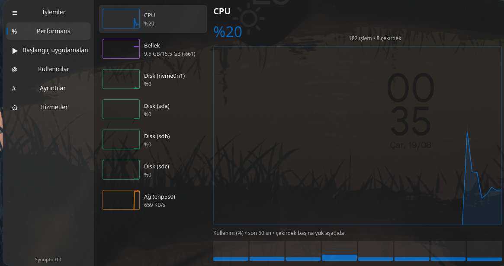

<div align="center">
  

# Synoptic

**The familiar task manager for Linux.**

Synoptic brings the information architecture and day-one familiarity of the
Windows 11 Task Manager to the Linux desktop — native, fast and
distribution-agnostic.


</div>

## Why

Linux has excellent monitors, but people switching from Windows keep looking
for *the* Task Manager: one tool that monitors **and** manages — processes,
performance, startup apps, users, details and services — with the exact
muscle memory they already have. Synoptic is that tool.

## Features

| Tab | What it does |
|---|---|
| **Processes** | Live list grouped into Apps / Background / System (systemd cgroups), type-to-search, column sorting, selection kept by PID, End task |
| **Performance** | Resource cards with mini graphs (CPU, memory, every physical disk, every NIC, every GPU); 60-second detail graphs; per-core load; disk active-time %; rx/tx with auto-scaling; GPU usage, VRAM and temperature |
| **Startup apps** | XDG autostart entries (system + user, localized names); enable/disable via the standard `Hidden=true` user-copy method |
| **Users** | Per-user process count, CPU and memory aggregates |
| **Details** | Every process incl. kernel threads and other users; state, user, CPU, memory; SIGTERM / SIGKILL |
| **Services** | systemd services; start / stop / restart with interactive polkit authorization |

Right-click any process for: End task, Force kill, **Freeze / Resume**
(SIGSTOP/SIGCONT — something even Windows doesn't offer), raise/lower
priority, open file location.

Like Windows, CPU percentages are relative to total machine capacity
(all cores = 100%).

## Install

Synoptic is in early development. Build from source with a recent stable
Rust toolchain:

```sh
git clone https://github.com/justtahsin/synoptic
cd synoptic
cargo build --release
./target/release/synoptic
```

Planned: prebuilt single-binary releases, Flathub, AUR.

## Design principles

- **The UI never runs as root.** Privileged operations go through polkit.
- **The monitor must be light.** Idle CPU target is under 1%; blocking work
  (e.g. waiting on a polkit prompt) never runs on the UI thread.
- **Core/UI split.** [`synoptic-core`](core/) (MIT OR Apache-2.0) collects
  data from `/proc`, systemd and XDG autostart with no UI dependencies —
  reusable by other projects. [`synoptic-app`](app/) (GPL-3.0-or-later) is
  the [Slint](https://slint.dev) interface using the fluent style.

## Roadmap

- [x] Processes, Performance, Startup apps, Users, Details, Services
- [ ] App history (persistent per-app usage accounting)
- [x] GPU monitoring (amdgpu sysfs: usage, VRAM, temperature; other vendors best-effort)
- [ ] Per-process GPU usage (DRM fdinfo) and NVIDIA support (NVML)
- [ ] Multi-process app grouping with expandable rows
- [ ] i18n (UI is Turkish-first today; English + gettext workflow planned)
- [ ] Native D-Bus (zbus) backend for services, replacing systemctl calls
- [ ] PSS-based memory accounting for visible rows
- [ ] Flathub / AUR packaging, prebuilt binaries

## Contributing

See [CONTRIBUTING.md](CONTRIBUTING.md). `cargo fmt` and
`cargo clippy --workspace --all-targets -- -D warnings` must pass.

## License

- `synoptic-app` (the application): **GPL-3.0-or-later** — [app/LICENSE](app/LICENSE)
- `synoptic-core` (the data layer): **MIT OR Apache-2.0** —
  [core/LICENSE-MIT](core/LICENSE-MIT), [core/LICENSE-APACHE](core/LICENSE-APACHE)

Synoptic is an independent project. It is not affiliated with or endorsed by
Microsoft; "Windows" is a trademark of Microsoft Corporation.
